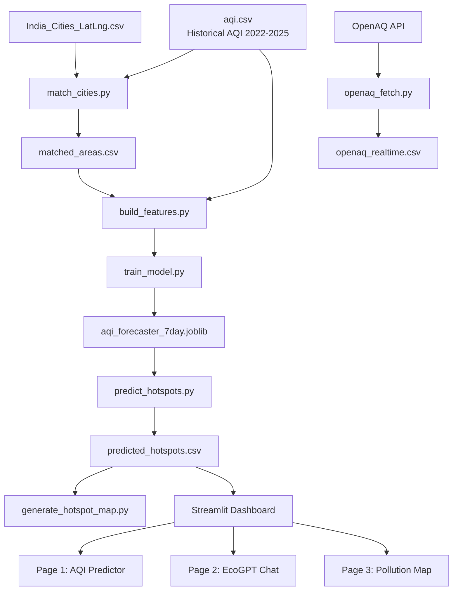

# Pollution_hotspot_predictor_with_LLM

AI-powered Pollution Hotspot Predictor that uses machine learning, LLMs (Ollama), and geospatial visualization to identify high-risk pollution zones. Features interactive hotspot maps, environmental insights, natural language queries, pollution forecasting, and location-based risk analysis for smarter environmental monitoring.

---

## Table of Contents

- [Overview](#overview)
- [Features](#features)
- [Architecture](#architecture)
- [Tech Stack](#tech-stack)
- [Project Structure](#project-structure)
- [Getting Started](#getting-started)
- [Usage](#usage)
- [Key Results](#key-results)
- [Data Sources](#data-sources)
- [Future Improvements](#future-improvements)
- [License](#license)

## Overview

This project forecasts air quality **7 days into the future** for cities and towns across India, and flags locations likely to become pollution **hotspots** — areas where the predicted Air Quality Index (AQI) crosses into CPCB's "Poor" category or worse.

It combines three layers:
- A historical dataset of daily AQI readings (2022–2025) across 291 Indian areas
- Live real-time measurements pulled from the [OpenAQ](https://openaq.org/) API
- A machine-learning forecasting model trained on engineered time-series features

The result is surfaced through an interactive **Streamlit dashboard** with three pages: an AQI predictor, an environmental-assistant chatbot (**EcoGPT**, powered by a local Ollama LLM), and a live hotspot map.

## Features

- 🔮 **7-day AQI forecasting** per city/area, using a gradient-boosted time-series model
- 🚨 **Automatic hotspot flagging** based on India's official CPCB AQI categories
- 🗺️ **Interactive geospatial map** with severity-coded markers, state/city filters, and dynamic zoom
- 💬 **EcoGPT** — a natural-language environmental assistant (local LLM via Ollama), scoped to environment/pollution/climate topics by an automatic topic classifier
- 🌐 **Live data integration** with the OpenAQ API for real-time "current conditions"
- 📊 **Full audit trail** — unmatched areas, ambiguous geocoding matches, and stale monitoring stations are tracked transparently rather than silently dropped

## Architecture



The pipeline runs as a sequence of independent, re-runnable scripts, each producing a CSV (or model file) consumed by the next stage — so the dashboard simply reads pre-computed outputs instead of re-running the model on every page load.

## Tech Stack

| Layer | Technology | Purpose |
|---|---|---|
| Data ingestion | `requests`, `python-dotenv` | OpenAQ API calls, secure API key loading |
| Data processing | `pandas` | Cleaning, merging, time-series feature engineering |
| Geocoding | `difflib`, `unicodedata` | Diacritic-safe exact & fuzzy city/state matching |
| Machine learning | `scikit-learn` (HistGradientBoostingRegressor), `joblib` | Model training & persistence |
| Visualization | Leaflet.js, CARTO basemap tiles | Interactive hotspot mapping |
| Dashboard | Streamlit | Multipage web application |
| Conversational AI | Ollama (local LLM serving) | EcoGPT environmental assistant |
| Standards | CPCB National AQI scale | AQI category thresholds & color coding |

## Project Structure

```
Pollution_hotspot_predictor_with_LLM/
├── app.py                       # Streamlit entry point (Page 1: AQI Predictor)
├── chatbot/
│   ├── filters.py                # Environment-topic classifier (Ollama)
│   ├── llm_handler.py            # Main response generator (Ollama)
│   └── Modelfile                 # Ollama custom-model definition
├── pages/
│   ├── 1_EcoGPT_Chat.py          # Page 2: chatbot UI
│   └── 2_Pollution_Map.py        # Page 3: interactive map with filters
└── data/raw/
    ├── aqi.csv                       # Historical daily AQI (2022-2025)
    ├── India_Cities_LatLng.csv       # City coordinates reference
    ├── match_cities.py               # Builds matched_areas.csv
    ├── matched_areas.csv             # Safe area -> lat/lon matches
    ├── review_cross_state.csv        # Ambiguous matches needing manual review
    ├── unmatched_areas.csv           # Areas with no confident match
    ├── openaq_fetch.py                # Live OpenAQ data fetcher
    ├── openaq_realtime.csv            # Accumulating live snapshots
    ├── build_features.py              # Feature engineering (training + live inference)
    ├── train_model.py                 # Trains & evaluates the forecasting model
    ├── aqi_forecaster_7day.joblib      # Trained model artifact
    ├── predict_hotspots.py            # Generates predictions for every area
    ├── predicted_hotspots.csv         # Latest hotspot predictions (dashboard reads this)
    ├── excluded_stale_areas.csv       # Audit trail of skipped stale stations
    └── generate_hotspot_map.py        # Standalone HTML map generator
```

## Getting Started

### Prerequisites

- Python 3.10+
- [Ollama](https://ollama.com/) installed and running locally (for the EcoGPT chat page)
- An [OpenAQ API key](https://openaq.org/) (free) for live data fetching

### Installation

```bash
git clone https://github.com/Butcher05/Pollution_hotspot_predictor_with_LLM.git
cd Pollution_hotspot_predictor_with_LLM

pip install streamlit pandas scikit-learn joblib requests python-dotenv ollama
```

Create a `.env` file inside `data/raw/` with your OpenAQ key:

```
OPENAQ_API_KEY=your_key_here
```

Set up the Ollama model used by EcoGPT:

```bash
cd chatbot
ollama create ecogpt -f Modelfile
```

## Usage

Run the data pipeline once (from `data/raw/`), in order:

```bash
python match_cities.py        # geocode areas to lat/lon
python openaq_fetch.py        # pull live OpenAQ readings (optional, for current conditions)
python train_model.py         # train the 7-day AQI forecaster
python predict_hotspots.py    # generate predictions + hotspot flags
python generate_hotspot_map.py  # (optional) standalone HTML map
```

Then launch the dashboard from the project root:

```bash
streamlit run app.py
```

This opens **Page 1 (AQI Predictor)** directly, with **EcoGPT Chat** and **Pollution Map** available in the sidebar.

## Key Results

Before trusting the model, it was benchmarked against the simplest possible forecast — *"the AQI in N days will equal today's AQI"* — at three different horizons:

| Horizon | Baseline MAE | Model MAE | Baseline R² | Model R² | Winner |
|---|---|---|---|---|---|
| 1 day ahead | 20.07 | 23.19 | 0.595 | 0.533 | Baseline wins |
| 3 days ahead | 29.05 | 25.70 | 0.220 | 0.434 | Model wins |
| 7 days ahead | 32.10 | 26.57 | 0.057 | 0.392 | **Model wins (largest margin)** |

AQI is so strongly autocorrelated day-to-day that "tomorrow = today" is nearly unbeatable at a 1-day horizon — but that assumption degrades fast as the horizon grows. **The 7-day horizon was deliberately chosen as the production target**, since that's where the trained model demonstrably earns its complexity rather than losing to a one-line baseline.

## Data Sources

- **Historical AQI** — daily CPCB-style readings, 235,785 rows, 2022-04-01 to 2025-04-30, 291 areas across 32 Indian states
- **City coordinates** — 188 Indian cities with lat/lon
- **[OpenAQ](https://openaq.org/)** — live air-quality sensor network, queried within a 25 km radius of each matched city

## Future Improvements

- Expand coordinate coverage with a larger towns/villages gazetteer or geocoding API
- Incorporate accumulated live OpenAQ history into model training, not just live inference
- Train separate models per forecast horizon (3-day, 7-day) and let users choose
- Automate the fetch → predict refresh cycle on a schedule
- Add spatial smoothing using neighboring areas' AQI as a feature
- Surface plain-language explanations alongside each prediction

## License

No license has been specified yet for this repository. If you intend to share or accept contributions, consider adding a `LICENSE` file — MIT is a common permissive choice for portfolio/academic projects.
